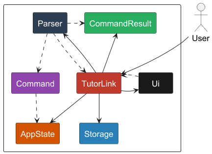
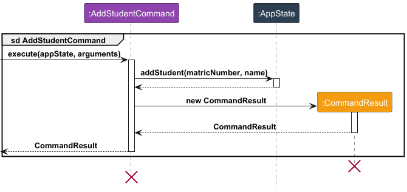

# Developer Guide

## Acknowledgements

{list here sources of all reused/adapted ideas, code, documentation, and third-party libraries -- include links to the
original source as well}

## Design & implementation

### Architecture

The high-level design of TutorLink is as depicted in the following **Architecture Diagram**:

**Main Components of the Architecture**

<code>TutorLink</code>: Main class that serves as the main entry point of the application.

- At app launch, TutorLink initializes components (<code>Parser</code>, <code>Ui</code>, <code>Storage</code>, <code>
  AppState</code>).
- On app shutdown, it shuts down the components and invokes cleanup methods.

The key classes providing functionality to TutorLink are:

1. <code>AppState</code>: Stores global variables/resources required by TutorLink at run time.
2. <code>Ui</code>: Collects data (via Strings sent via CLI) from the user and relays information to the user (via
   printing back to the CLI).
3. <code>Parser</code>: Interprets the raw data from the user; applies data validation and handles necessary exceptions.
4. <code>Storage</code>: Handles the loading and storage of data to be retained even after TutorLink is shut down.
5. <code>CommandResult</code>: Represents the result of user input.

### Target User Profile

The target users for **TutorLink** are professors at NUS who manage small, single-staffed classes. These professors
typically have strong technical expertise but are often overwhelmed by time-consuming administrative tasks that detract
from their ability to focus on teaching and curriculum development.

#### Key Characteristics:

- **Time-Constrained**: Professors have limited time for lesson preparation due to the administrative burden of managing
  grades, assignments, and attendance.
- **Technologically Savvy**: While proficient in using educational platforms, they often find existing tools slow,
  overly complex, or requiring constant internet connectivity.
- **Desire for Simplicity**: They prefer tools that are easy to use, automate repetitive tasks, and function offline,
  allowing them to streamline administrative work without unnecessary complexity.

The target user values efficiency, reliability, and simplicity, seeking a solution that reduces administrative workload
and enables them to focus more on the core aspects of teaching.

### Value Proposition

**TutorLink** solves the problem of administrative overload by automating routine tasks such as managing assignments,
and monitoring student performance. Professors often struggle with time-consuming admin work that takes away from their
primary focus: teaching and preparing lessons.

By offering an offline, lightweight solution that simplifies these processes, TutorLink helps professors:

- Save time by automating tedious administrative tasks.
- Access important information quickly, without needing an internet connection.
- Focus on teaching and lesson development instead of being bogged down by admin work.

In contrast to bloated systems, TutorLink is designed to be fast, simple, and effective—freeing up valuable time and
enhancing teaching efficiency.

## User Stories

| Version | As a ... | I want to ...             | So that I can ...                                           |
|---------|----------|---------------------------|-------------------------------------------------------------|
| v1.0    | new user | see usage instructions    | refer to them when I forget how to use the application      |
| v2.0    | user     | find a to-do item by name | locate a to-do without having to go through the entire list |

## Non-Functional Requirements

{Give non-functional requirements}

1. Performance: The system should respond to any command within a few seconds
2. Reliability: The system should not lose any user data even if it crashes unexpectedly
3. Usability: A new user should be able to use basic features without confusion
4. Compatibility: The system should work on any mainstream OS (Windows, macOS, Linux) that has Java 11 or above
   installed
5. Maintainability: The system should be able to export all data in a human-readable format for backup purposes

## Glossary

* *glossary item* - Definition

## Instructions for manual testing

{Give instructions on how to do a manual product testing e.g., how to load sample data to be used for testing}

## Implementation

### Command execution sequence: 

All commands follow the sequence as described in the diagram below: 

Where <code>ref</code> frame is a placeholder for each command's specific operations.

The specific implementation of noteworthy operations are presented below: 

### Add/Delete Student/Component Feature

Feature implemented by `AddStudentCommand`, `DeleteStudentCommand`, `AddComponentCommand` and `DeleteComponentCommand` 
for `Student` and `Component` respectively. 

The flow of logic for both `Student` and `Component` commands can be summarized as follows: 

1. Retrieve arguments from `HashMap`.
2. Execute data validation on the arguments and throw appropriate exception in the case of failure.
3. Add/Delete `Student` and `Component`.
4. Return `CommandResult` that contains the result of the Add/Delete operation.

The following sequence diagrams depict the exact steps involved in the `AddStudentCommand`:

The logic for `AddComponentCommand` is very similar and thus is not depicted. 

Likewise, the sequence diagram for `DeleteStudentCommand` is as follows: 

Since a `Grade` object is only well-defined when there are both `Student` and `Component` objects to be refrenced by `Grade`,
whenever a `Student` or `Component` object is deleted, the corresponding `Grade` object is queried and then deleted as well. 

### Add/Delete Grade Feature

#### Implementation Details

The `AddGradeCommand` and `DeleteGradeCommand` classes handle the addition and deletion of grades for students within the TutorLink application. Each command validates user input to ensure accuracy and consistency before making changes, preserving data integrity. Grades are stored as `Grade` objects within a `GradeList`.

#### Key Operations

- **`AddGradeCommand.execute(AppState appState, HashMap<String, String> arguments)`**: Adds a grade to a student by performing the following steps:
  1. Retrieves and validates the matriculation number, component description, and score from `arguments`.
  2. Checks that the specified component and student exist.
  3. Ensures the score is within the allowable range for the specified component.
  4. Creates a new `Grade` object and adds it to the `GradeList` in `AppState`.

- **`DeleteGradeCommand.execute(AppState appState, HashMap<String, String> arguments)`**: Removes a grade from a student by performing these steps:
  1. Retrieves and validates the matriculation number and component description from `arguments`.
  2. Confirms the existence of the specified component and student.
  3. Locates and deletes the `Grade` object from the `GradeList` in `AppState`.

#### Example Usage Scenario

Step 1: The user has launched the application, with students and graded components already registered in TutorLink.

Step 2: The user issues a command (e.g., `add_grade`), which the parser processes, creating an `AddGradeCommand` instance and a `HashMap` containing the relevant parameters.

Step 3: `AddGradeCommand` is executed within the `TutorLink`, receiving both the current app state and the `HashMap` of arguments.

Step 4: The command extracts `matricNumber`, `componentDescription`, and `scoreNumber` from the `HashMap`. If any parameter is `null`, an `IllegalValueException` is thrown.

Step 5: The specified component is located within the application using `componentDescription`. If no match is found or duplicates exist, an exception is thrown.

Step 6: The student is identified using `matricNumber`, with exceptions raised for missing or duplicate entries.

Step 7: The `scoreNumber` is converted to a `double` and checked to ensure it is within the acceptable range for the component. Negative values, scores exceeding the component maximum, or non-numeric inputs result in an exception.

Step 8: Using the `double` score and the identified student and component, a `Grade` object is created.

Step 9: The new `Grade` object is added to the `GradeList`.

### Storage feature

#### Implementation

The `Storage` class is responsible for the automatic loading and saving of list data to and from `.txt` files,
so that data will be retained between runs of the application.

#### Example Usage Scenario

Step 1: The user launches the application. During startup, the `main` method calls constructors for `Storage` objects
for each of `StudentList`, `ComponentList` and `Gradelist`.

Step 2: The predefined filepaths are passed into the constructor. The directory and file are created if they do not
currently exist.

<Insert Sequence diagram here, todo>
