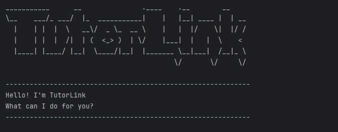

### TutorLink

TutorLink is a desktop CLI application designed to help
University professors better manage the grades of students
reading their course.

Useful links:
* [User Guide](UserGuide.md)
* [Developer Guide](DeveloperGuide.md)
* [About Us](AboutUs.md)
